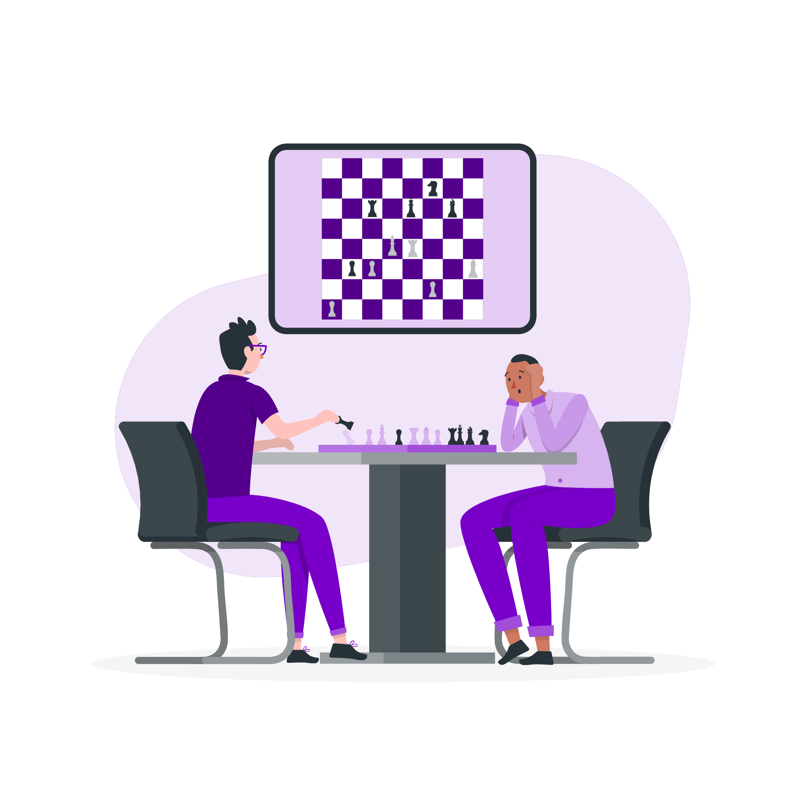
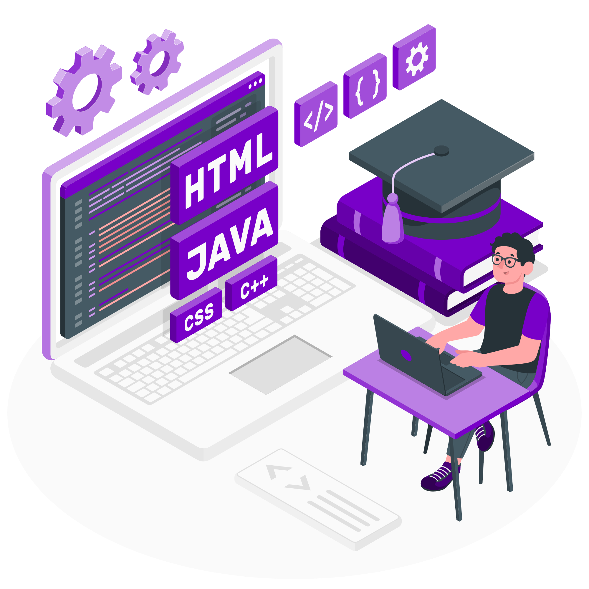
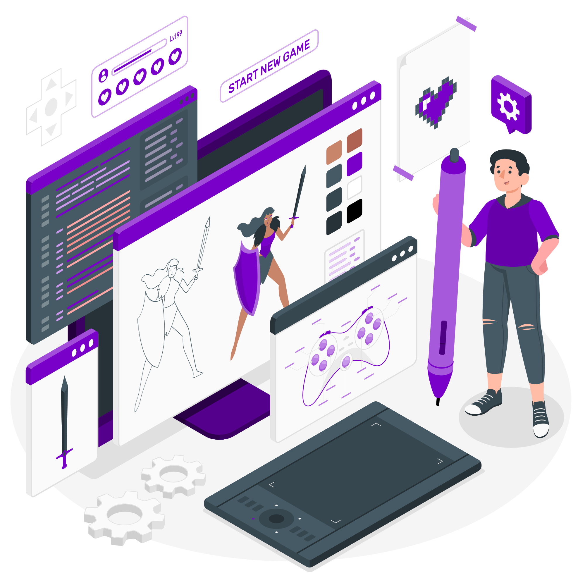

<H2 align = "left"> Sobre Mim </H2>

Eu sou o Nycolas, um estudante da USJT (Universidade São Judas Tadeu), e estou em busca de uma oportunidade de emprego como um prospecto estagiário.

Estou no curso de Ciências da Computação, e tive experiências com Organização como monitor / representante por 5 semestres até então, além de gerenciar e documentar projetos em grupo variados baseados na premissa de criar uma empresa fictícia e um produto adequado ao nível acadêmico que coincida com a ementa do curso.

    

<H2 align = "left"> Tecnologias</H2>

Tive experiência com o <cite>Pacote Office</cite>, <cite>StarUML</cite> e <cite>Figma</cite> para o desenvolvimento de competências de Engenharia de Software.

Além da experiência com <cite>Excel</cite>, <cite>Power BI</cite> e <cite>SQL</cite> com infraestrutura <cite>MySQL</cite> para o desenvolvimento de minhas competências e habilidades de Data Science.

Experimentei diversas IDE's e Frameworks populares para desenvolvimento, entre eles <cite>VSCode</cite>, <cite>Eclipse</cite> e <cite>PyCharm</cite>.

    

<H2 align = "left"> Linguagens de Programação</H2>

Com <cite>Python</cite>, explorei bibliotecas de Análise de Dados como <cite>Pandas</cite>, <cite>NunPy</cite> e <cite>MatLab</cite>.

Usei <cite>HTML</cite>, <cite>CSS</cite> e <cite>JavaScipt</cite> para o desenvolvimento de Websites e Aplicações Web profissionais e dinâmicas.

Com <cite>Java</cite> e <cite>SQL</cite>, criei diversas Aplicações com o objetivo de aplicar soluções tangiveis em diversas áreas.

    

<H2 align "left"> Hobbies </H2>

Meus principais hobbies são a leitura e a criação de projetos pessoais, sobretudo Game Design, usando as tecnologias <cite>Godot</cite>, <cite>Asesprite</cite> e <cite>Audacity</cite>.

       

<H2 align "left"> Contato </H2>

 Você pode me contactar aqui: 

<a href = "https://www.linkedin.com/in/NycolasAGRGarcia/">LinkedIn</a> 
<a href = "mailto:nycolasagrg.work@gmail.com">Gmail</a> 
<a href = "https://github.com/NycolasGarcia">Github</a> 

